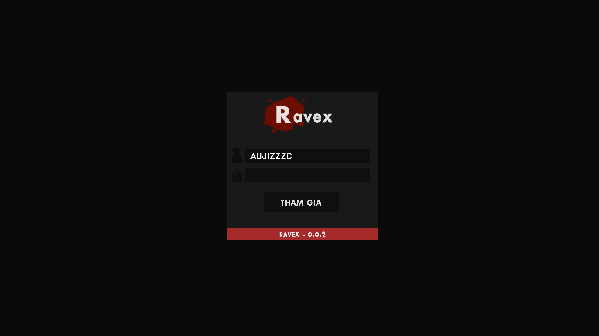
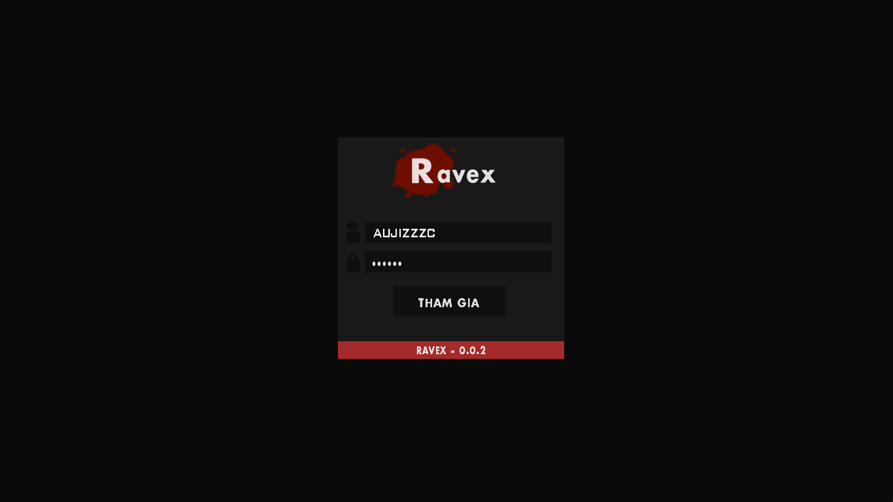

# Aujiz-Base-Gamemode

[Tiếng Việt](README.md) | English

## Introduction
Aujiz Base Gamemode is a gamemode source for open.mp servers, designed for developers who want to build or extend Open Multiplayer server systems. The project focuses on modular architecture, maintainability, extensibility, and integration with popular plugins.

**View [update log](UPDATE.md)**

## Preview

## Plugins Used
| Plugin      | Link |
|-------------|------|
| MySQL       | [github.com/pBlueG/SA-MP-MySQL](https://github.com/pBlueG/SA-MP-MySQL) |
| Streamer    | [github.com/samp-incognito/samp-streamer-plugin](https://github.com/samp-incognito/samp-streamer-plugin) |
| PawnPlus    | [github.com/IS4Code/PawnPlus](https://github.com/IS4Code/PawnPlus) |
| SAMP BCrypt | [github.com/Sreyas-Sreelal/samp-bcrypt](https://github.com/Sreyas-Sreelal/samp-bcrypt) |
| CrashDetect | [github.com/AmyrAhmady/samp-plugin-crashdetect](https://github.com/AmyrAhmady/samp-plugin-crashdetect) |
| sscanf | [github.com/Y-Less/sscanf](https://github.com/Y-Less/sscanf) |
| Pawn.CMD | [github.com/katursis/Pawn.CMD](https://github.com/katursis/Pawn.CMD) |

## Architecture

- The source is built with PawnPlus, utilizing asynchronous (async) and dynamic arrays for optimal performance and flexible expansion.
- Data is stored and queried via MySQL, ensuring speed and reliability for the system.
- User passwords are encrypted with Bcrypt, enhancing account security.
- Clear modular architecture: config, core, player, authentication, making maintenance and feature development easier.
- Dialog system uses asynchronous calls, improving user experience for login/registration.
- Player state and information are managed in a modern way, easy to integrate with auxiliary systems.
- Easily extendable, allowing integration of new plugins or modules for custom server needs.

## Requirements
- [open.mp Server v1.4.0.2779](https://github.com/openmultiplayer/open.mp/releases) or newer
- Required plugins (see plugins folder)

## Contribution
For feedback, bug reports, or feature requests, please contact via Github or the author's email.

## Author Information
Email: letuank2018@gmail.com
